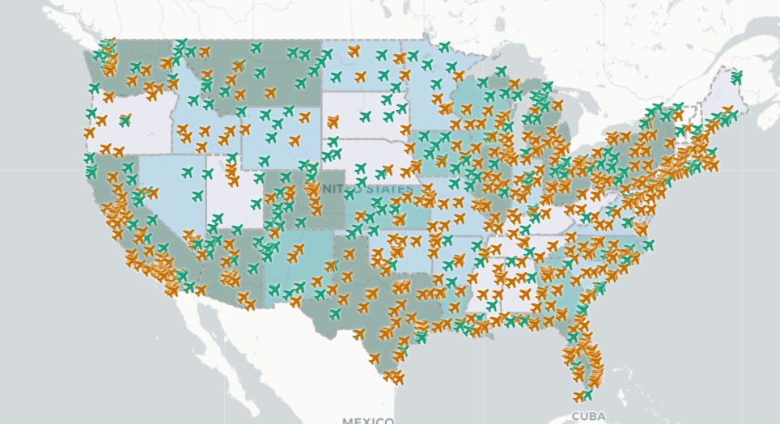

# US Airports (July 2017)
***
### Project Introduction
This simple project maps out all the registered airports in the United States as of July 2017. In this map, I took a look at airports that have control towers and ones that do not. Furthermore, the density of airports (count of number of airports) per state is represented through the choropleth map.

***
### Features
Features in this project include:
- displays a pop-up containing information about the airport
- legend to quickly understand the map
- scale
- zoom-in/zoom-out
***
### Libraries Used
Multiple libraries/packages/APIs were used in the development of this project:
- `chroma.js`
- `leaflet.js`
- `jquery`
- `Google Fonts`
- `Font Awesome`
***
### Data Sources
Data for the development of this project was obtained through:
- `airports.geojson` from [here](https://catalog.data.gov/dataset/usgs-small-scale-dataset-airports-of-the-united-states-201207-shapefile)
- `us-states.geojson` from Mike Bostock of D3 [here](https://bost.ocks.org/mike/)

***
### Acknowledgements

Overall project idea and content originated from GEOG458: Advanced Digital Technologies taught by Professor [Bo Zhao](https://hgis.uw.edu/).
